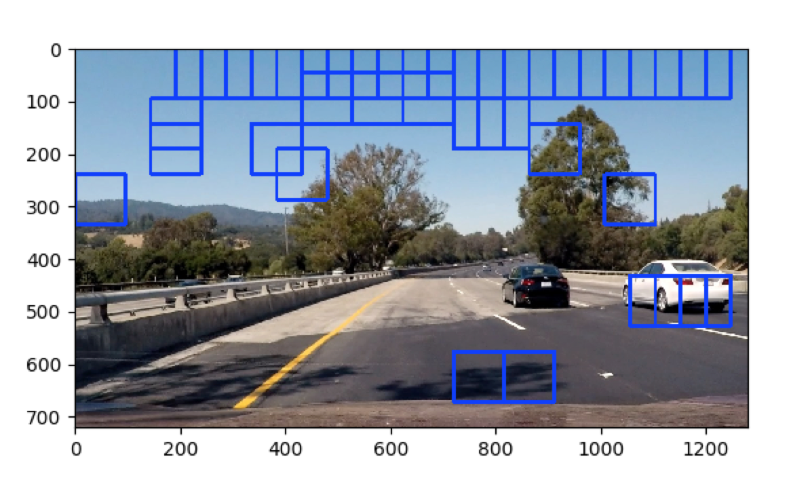

# Vehicle Detection and Tracking
---

**Vehicle Detection Project**

The goals / steps of this project are the following:

* Perform a Histogram of Oriented Gradients (HOG) feature extraction on a labeled training set of images and train a classifier Linear SVM classifier
* Optionally, you can also apply a color transform and append binned color features, as well as histograms of color, to your HOG feature vector. 
* Note: for those first two steps don't forget to normalize your features and randomize a selection for training and testing.
* Implement a sliding-window technique and use your trained classifier to search for vehicles in images.
* Run your pipeline on a video stream (start with the test_video.mp4 and later implement on full project_video.mp4) and create a heat map of recurring detections frame by frame to reject outliers and follow detected vehicles.
* Estimate a bounding box for vehicles detected.

## [Rubric](https://review.udacity.com/#!/rubrics/513/view) Points
### Here I will consider the rubric points individually and describe how I addressed each point in my implementation.  


### Histogram of Oriented Gradients (HOG)

#### 1. Explain how (and identify where in your code) you extracted HOG features from the training images.

The code for this step is contained in the 2nd code cell of the Jupyter notebook.

I started by reading in all the `vehicle` and `non-vehicle` images.  Here is an example of one of each of the `vehicle` and `non-vehicle` classes:


I then explored different color spaces and different `skimage.hog()` parameters (`orientations`, `pixels_per_cell`, and `cells_per_block`).  I grabbed random images from each of the two classes and displayed them to get a feel for what the `skimage.hog()` output looks like.

Here is an example using the `YCrCb` color space and HOG parameters of `orientations=9`, `pixels_per_cell=(8, 8)` and `cells_per_block=(2, 2)`:


#### 2. Explain how you settled on your final choice of HOG parameters.

Initially, I used only HOG features in the RGB color space, and take only 1 channel as input, at the same time, I used color bin features, all the parameters are the same like the ones I used in the course. I was suprised by the classifier accuracy, 94% ! Considering it is not easy get 94% accuracy in deep learning model, I thought it was very good result, until I tried it on real image. related code is in `vehicle_detection.py` line `156-166`, the result was ... not good:



So I had to go back to play with my feature extraction. I added spatial feature, and changed `pix_per_cell = 4`, `cell_per_block = 1`, `hog_channel = 'ALL'`, `spatial_size = (16, 16)`, etc. and trained again, this time, the accuracy jump to 97.89%. Great! But to be disappointing, it is still not good when I use it on real image.


During trouble shooting and test on images and video, I find it very confusing to use different color space due to opencv's BGR preference, so I ended up read all the images and videos with **OpenCV**. to my suprise, when I train the classifier agian, the accuracy jumped again to 99.04 %. There must be something wrong with my color space before. What's more, the trail on road image gives very clean result! Lesson learnt, if you need to use OpenCV, try to use OpenCV everywhere. Look at the result:


At this point, I think my classifier is good to go, but I did minor change in the parameters, to finally make the accuracy reach 99.32%, dump to disk and make it standard later on. Below are my parameters:

```
color_space = 'YCrCb'  # Can be BGR, HSV, LUV, HLS, YUV, YCrCb
orient = 8  # HOG orientations
pix_per_cell = 8  # HOG pixels per cell
cell_per_block = 2  # HOG cells per block
hog_channel = 'ALL'  # Can be 0, 1, 2, or "ALL"
spatial_size = (32, 32)  # Spatial binning dimensions
hist_bins = 32  # Number of histogram bins
spatial_feat = True  # Spatial features on or off
hist_feat = True  # Histogram features on or off
hog_feat = True  # HOG features on or off
```

#### 3. Describe how (and identify where in your code) you trained a classifier using your selected HOG features (and color features if you used them).

I trained a linear SVM using HOG, spatial, bined color histogram features all together. The training takes place in `train_clf.py`, after training, the classifier is dumped to local disk for further usage.

### Sliding Window Search

#### 1. Describe how (and identify where in your code) you implemented a sliding window search.  How did you decide what scales to search and how much to overlap windows?

I took the advise in the course, to use different sizes of windows and search different regions for each size. Smaller window only search near horizon, larger window will scan a bigger range. Below is a demostration of the window searching area, I made an algorithm to automatically generate window sizes and corresponding search area, the code (in `cfg.py`)is not that readable, if you're patient enough, it's just simple math. Here is a demostration of how it works:


All you need to do is modify the following 4 lines in `cfg.py`:

```
y_start_stop = [350, 700]  # Min and max in y to search in slide_window()
smallest = [420, 500]  # vertical boundaries for the smallest slid window
...
ysize_series = (64 * np.logspace(-1, 3, num=3 + 1 + 1, base=1.5)).astype(int)
...
min_overlap = 0.6
```

then it will calculate series of parameters:

```
ysize_series:  
[ 42  64  96 144 216]
y_bound_list:  
[[420 500]
 [409 523]
 [394 558]
 [375 614]
 [350 700]]
xy_winshape:  
[[ 42  42]
 [ 64  64]
 [ 96  96]
 [144 144]
 [216 216]]
overlap_xy 
[[ 0.6016731   0.6984127 ]
 [ 0.60416667  0.609375  ]
 [ 0.60215054  0.64583333]
 [ 0.60555556  0.67013889]
 [ 0.62108262  0.68981481]]
```

iterate through the above parameters, you will get all the windows you want.

I set the minimum overlap to be 60%, it seems to give a good result.


#### 2. Show some examples of test images to demonstrate how your pipeline is working.  What did you do to optimize the performance of your classifier?

Ultimately I searched on 5 scales using YCrCb 3-channel HOG features plus spatially binned color and histograms of color in the feature vector, which provided a nice result.  Here are some example images, I put gussian blur to heat map, hoping it could give smoother result (but actually it doesn't work that well, need more tuning):


---

### Video Implementation

#### 1. Provide a link to your final video output.  Your pipeline should perform reasonably well on the entire project video (somewhat wobbly or unstable bounding boxes are ok as long as you are identifying the vehicles most of the time with minimal false positives.)
Here's a [**YouTub** link to my video result](https://youtu.be/3XbAJEAkZTM)


#### 2. Describe how (and identify where in your code) you implemented some kind of filter for false positives and some method for combining overlapping bounding boxes.

I recorded the positions of positive detections in each frame of the video.  From the positive detections I created a heatmap, in order to make the result smooth, I defined a `BBoxs` class, save boxes detected by n consecutive images, n is the buffer size, then plot all these boxes into a single map and thresholded that map to identify vehicle positions. Before Thresholding, I also applied Gussian blur, for the sake of making it smooth. It didn't work out like magic as I expected, but also not make things worse, so I kept it as a feature that might be implemented better in the future. I then used `scipy.ndimage.measurements.label()` to identify individual blobs in the heatmap.  I then assumed each blob corresponded to a vehicle.  I constructed bounding boxes to cover the area of each blob detected.  

Here's an example result showing the heatmap from a series of frames of video, the result of `scipy.ndimage.measurements.label()` and the bounding boxes then overlaid on the last frame of video:

### Here are four frames and their corresponding heatmaps:


### Here is how the output of `scipy.ndimage.measurements.label()` looks like:


### Here the resulting bounding boxes are drawn onto the last frame in the series:


---

### Discussion

#### 1. Briefly discuss any problems / issues you faced in your implementation of this project.  Where will your pipeline likely fail?  What could you do to make it more robust?

Besids what's mentioned above, I want to note that the algorithm for smoothing the output box is not perfect. Although I tried to use Gaussian blur, it is still jumping around, I thought of average the bbox start and stop point, but the total number of cars that is tracking can vary, I cannot think of an effective way to track it. In the course it was mentioned that getting the feature for the whole image, then selectively take the features from the pool is much faster than feeding individual picture patches into the pipline, but I couldn't get enough time to implement, the same reason why I didn't add lane line detection to this project, hope it's not too disappointing to submit like this, will come back around when I get chance.

### File list of my work:
`vehicle_detection.py`    main detection file

`train_clf.py` train classifier

`cfg.py` global variables

`lesson_functions.py` contains a lot of functions from class, used in many places

`heatmap_draw.py` contains function to draw heat map and final bounding box.

`./output_videos/project_video_output.m4v` project video, a green part at the bottom emerge after compression.

[https://youtu.be/3XbAJEAkZTM](https://youtu.be/3XbAJEAkZTM) video can also be found here

`./output_images/` support images for this README.md

`README.md` project writeup